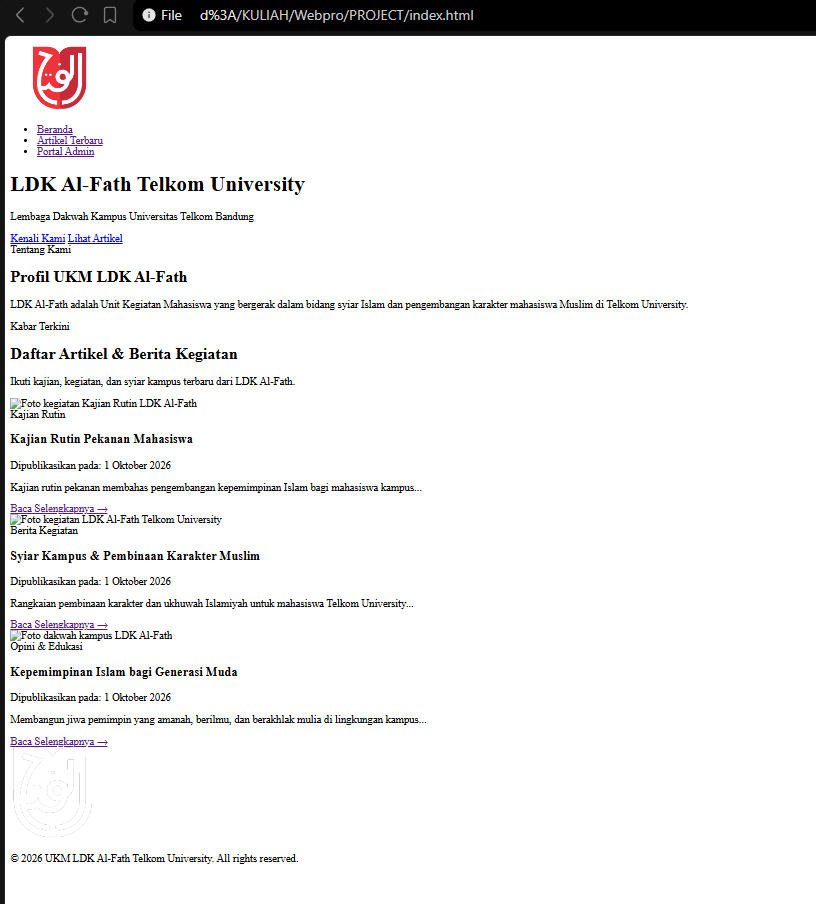
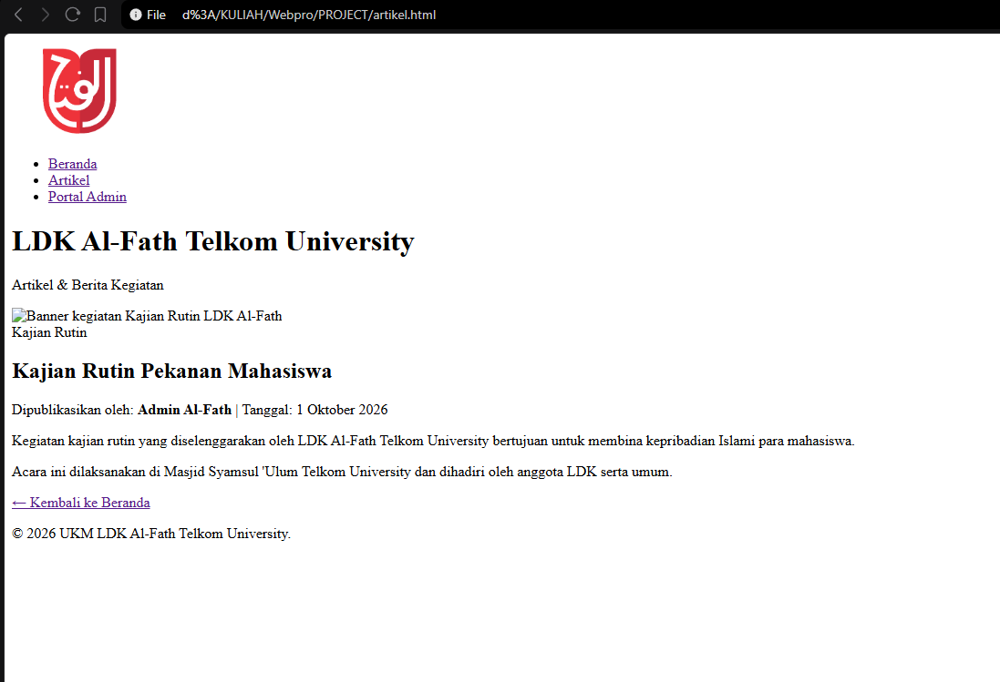
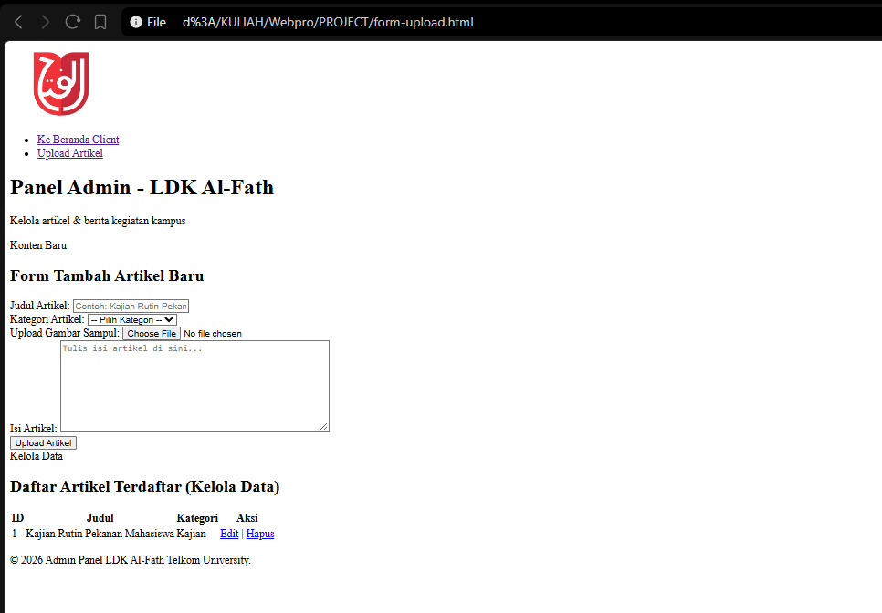
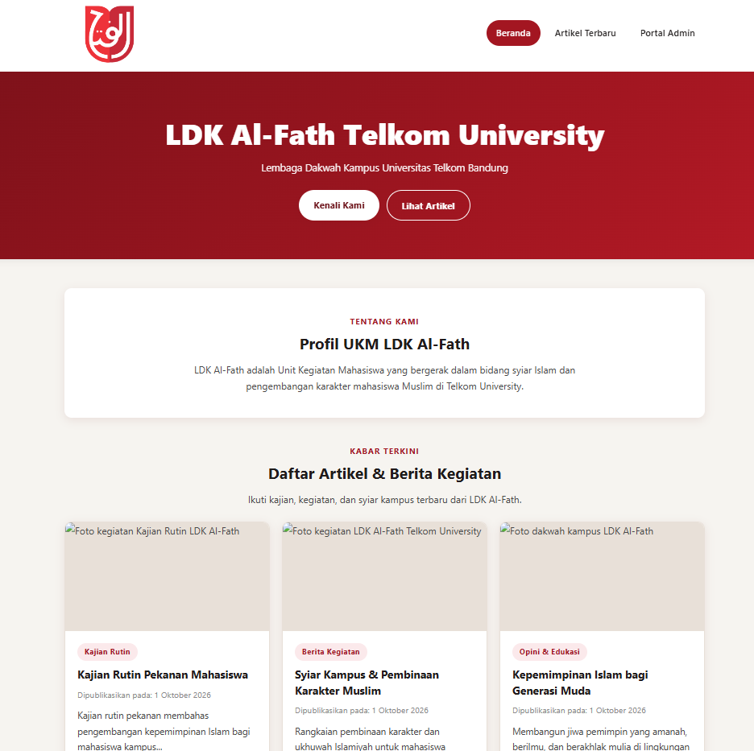
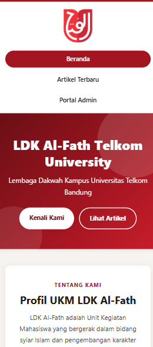
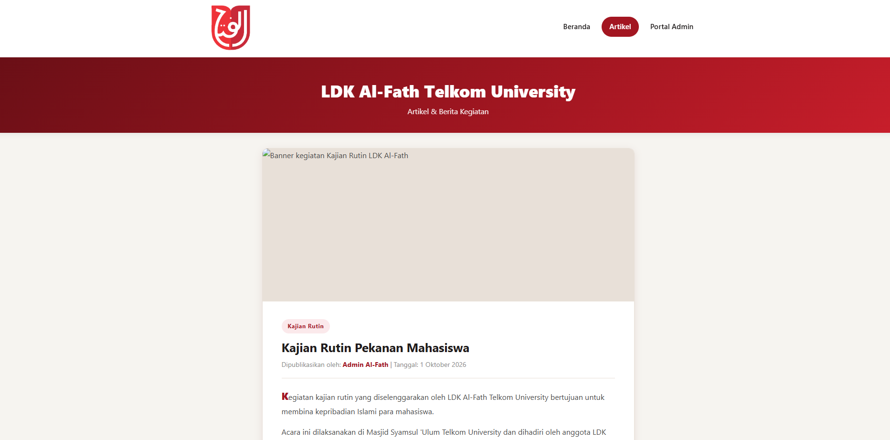
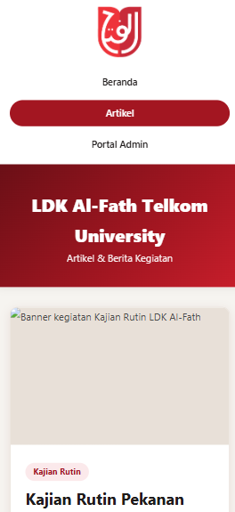
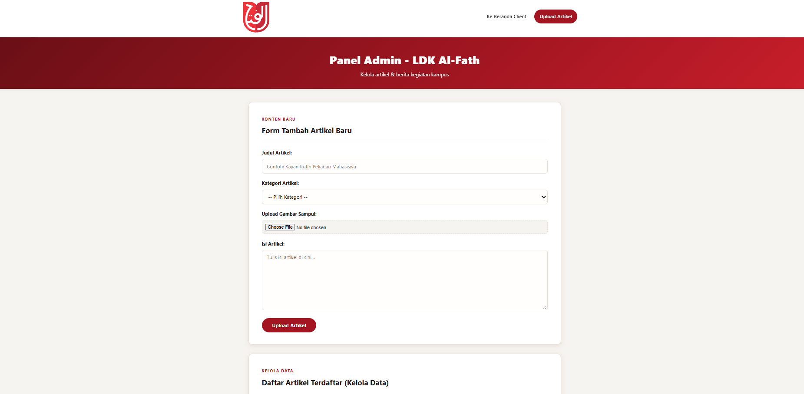
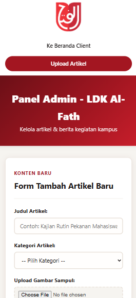

# LDK Al-Fath Telkom University — Website Profil & Artikel

### Minggu ke-2 (W2) — Struktur HTML tanpa CSS

Fokus: kerangka semantik semua halaman, belum ada styling.

| File         | Halaman                                  | Screenshot                              |
| ------------ | ---------------------------------------- | --------------------------------------- |
| `w2_1.png` | Beranda (`index.html`) polos           |  |
| `w2_2.png` | Detail artikel (`artikel.html`) polos  |  |
| `w2_3.png` | Panel admin (`form-upload.html`) polos |    |

Minggu ke-3 (W3) — Styling Pure CSS + Responsive

**1. Beranda**

| Desktop                                         | Mobile (responsive)                             |
| ----------------------------------------------- | ----------------------------------------------- |
|  |  |

**2. Detail Artikel**

| Desktop                                         | Mobile (responsive)                             |
| ----------------------------------------------- | ----------------------------------------------- |
|  |  |

**3. Panel Admin**

| Desktop                                       | Mobile (responsive)                           |
| --------------------------------------------- | --------------------------------------------- |
|  |  |
